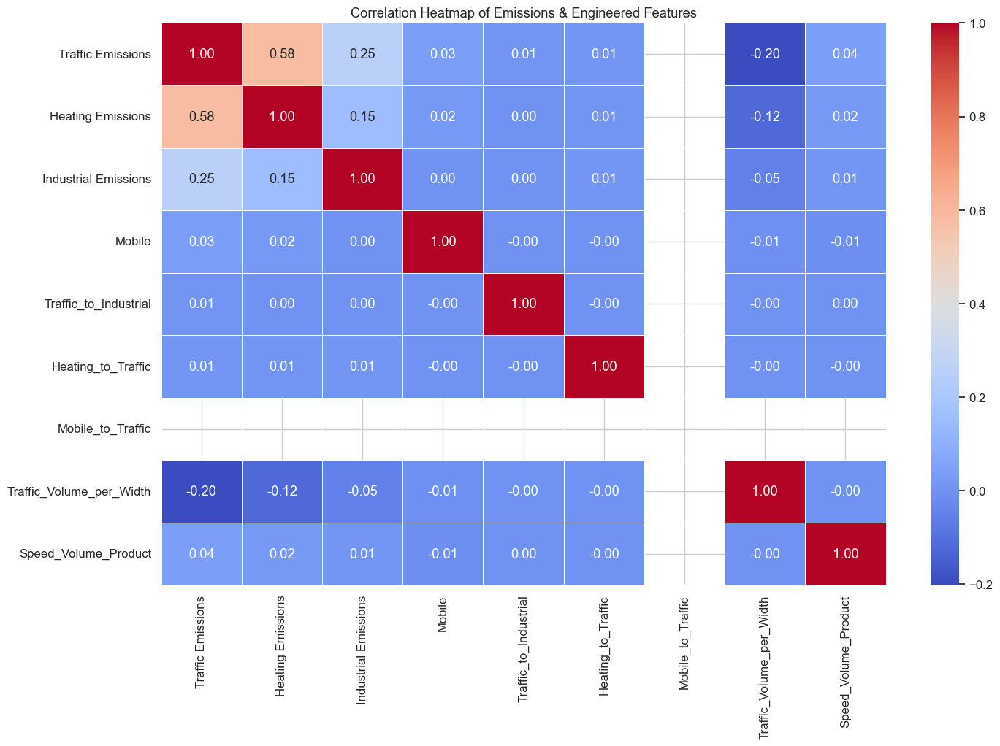
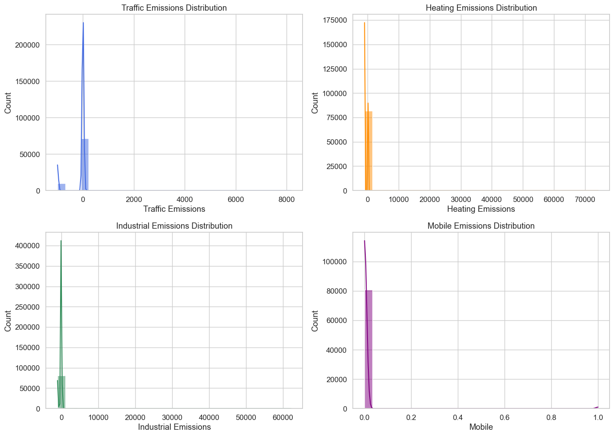
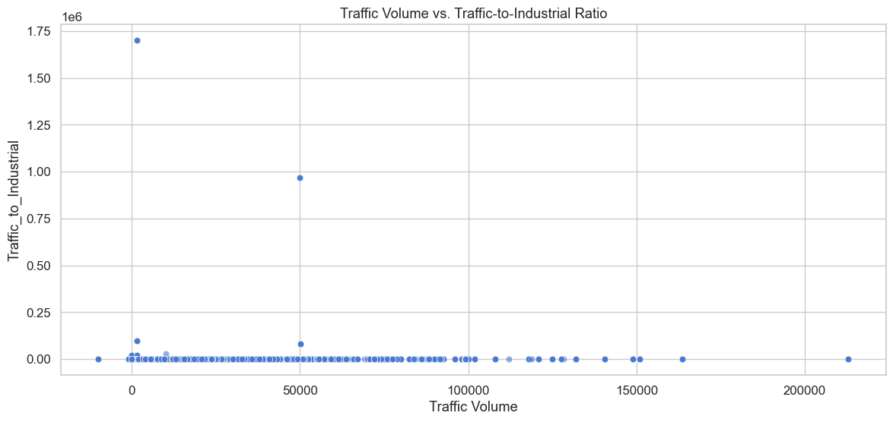
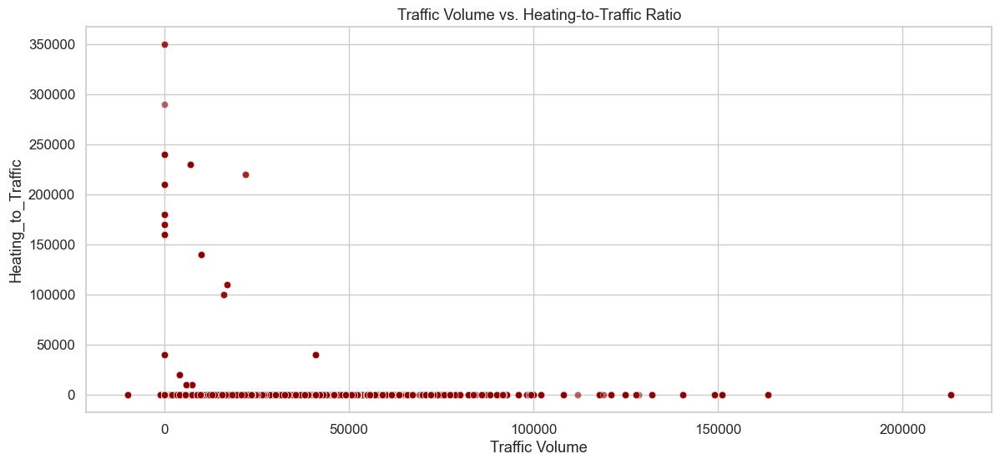
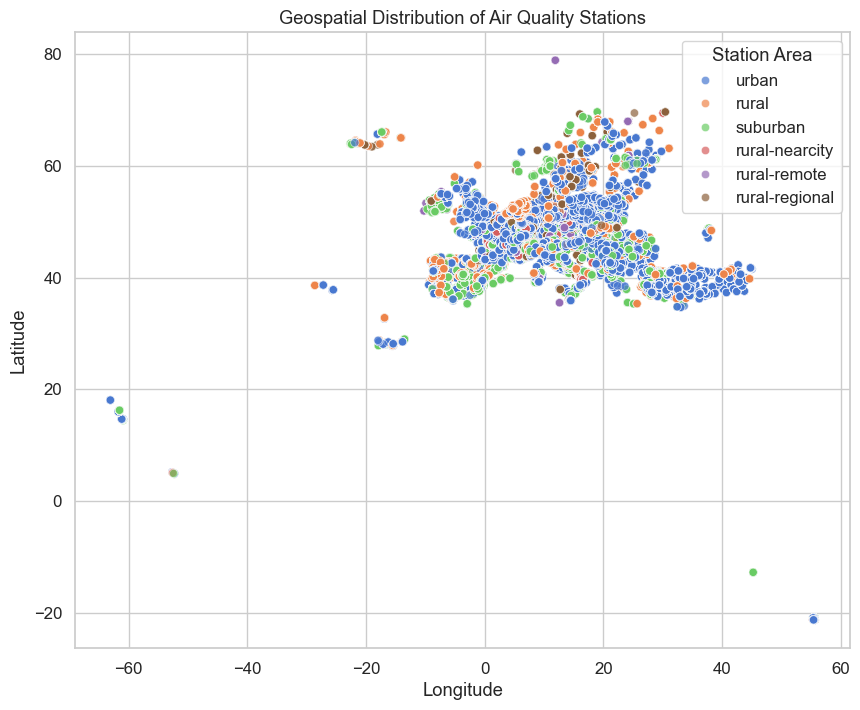
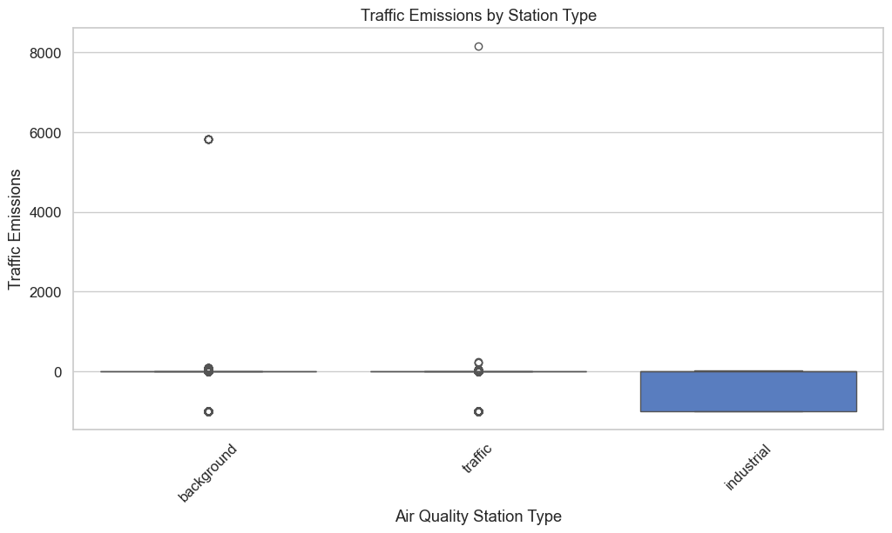

# Exploratory Data Analysis (EDA) Report

This report summarizes the exploratory analysis of air quality and emissions data.

## Correlation Heatmap

## Emission Distributions

## Scatterplots
### Traffic Volume vs Traffic-to-Industrial

### Traffic Volume vs Heating-to-Traffic

## Geospatial Distribution

## Boxplot of Traffic Emissions by Station Type

---

**Generated automatically as part of EDA pipeline.**
